# CampusTrack 📱🔍

> A Flutter & Firebase-based Smart Lost and Found Management System designed to digitalize, streamline, and automate lost-and-found tracking in educational institutions.

[](https://flutter.dev)
[](https://dart.dev)
[](https://firebase.google.com)
[](https://firebase.google.com/docs/firestore)
[](LICENSE)

---

## 📽️ Demo & Walkthrough

Explore the live video walkthrough of the app in action:

[](https://go.screenpal.com/watch/cTlooJnYvRw)

---

## 📌 Project Overview

Traditionally, lost and found processes on college campuses are managed through manual means, such as physical notice boards, paper log registers, or circulars. This leads to slow communication, data loss, and a low recovery rate. **CampusTrack** solves these challenges by providing a single, unified digital platform where students, faculty, and administrative staff can interact in real time to report, verify, track, and retrieve items.

The mobile frontend is built using **Flutter**, allowing a responsive and native user experience across platforms. The backend is powered by **Firebase** as a Backend-as-a-Service (BaaS), offering features like instant database synchronization, secure role-based access control, file storage, and real-time push alerts. By automating item verification and recovery workflows, CampusTrack reduces the administrative burden and fosters transparency across the campus.

---

## ✨ Features

*   **🔒 Secure Role-Based Authentication:** Dynamic role routing for **Students / Faculty** and **Office Admins** using Firebase Authentication. Includes Google Sign-In and automated email-based password recovery.
*   **📸 Rich Item Reporting:** Easily post lost or found items with images (uploaded to Firebase Storage with local compression), categories, dates, and locations.
*   **🔎 Intelligent Search & Filter:** Quick keyword search and filtering by status (Pending, Verified, Returned), date, or category to locate items quickly.
*   **📅 Verification & Scheduling Flow:** Admins can verify the authenticity of reported items, schedule pickup dates and times, and capture verification details like ID card photos upon return.
*   **🔔 Real-Time Notifications:** Push alerts (using Firebase Cloud Messaging) notify students immediately when their items are verified or scheduled for pickup.
*   **📊 Excel Log Export:** Allows administrative staff to export active lost and found records or historical logs into standard Excel spreadsheets for administrative audits.

---

## 🛠️ Tech Stack

| Technology | Category | Description |
|---|---|---|
| **Flutter** | Frontend Framework | High-performance, cross-platform UI rendering |
| **Dart** | Programming Language | Typed language powering Flutter |
| **Firebase Auth** | Security | Identity management & role credentials validation |
| **Cloud Firestore** | Database | NoSQL real-time database for sync across clients |
| **Firebase Storage** | Cloud Storage | Secure repository for item photos and verification docs |
| **FCM & Local Notifications** | Alerts | Immediate transactional notifications |
| **Provider** | State Management | Clean state distribution within the application |
| **Syncfusion XlsIO** | File Operations | Direct generation of custom Excel reports |

---

## 📐 System Architecture

The following diagram illustrates the interaction between the multi-role users, the Flutter app layers, and the Firebase cloud infrastructure:

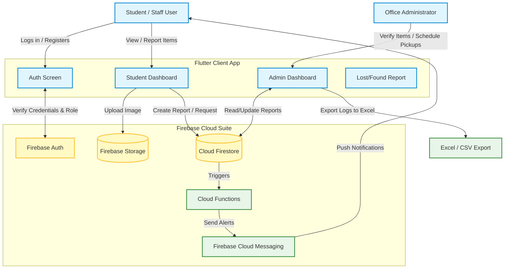

---

## 📁 Project Structure

```text
lib/
├── features/
│   ├── auth/           # Login, Signup, Profile, and Password Reset screens
│   ├── home/           # Dashboard logic (Student/Admin dashboards), Welcome, and Notifications
│   ├── items/          # Add item, list items, card widgets, and detailed item screens
│   └── office/         # Collection requests, request details, and item verification
├── models/             # Data models (AppUser, ItemModel, OfficeModel)
├── providers/          # Providers for state management (Auth, Items, Office)
├── repositories/       # Repositories for Firestore querying (Auth, Item, Office)
├── services/           # Firebase integrations (Auth, Firestore, Storage, Notification, Session Controller)
└── utils/              # Helper utilities (validators, formatters, date/role helpers)
```

---

## 📸 Screenshots

Here is a visual walkthrough of the main interfaces of the application:

### 🔑 Authentication & Dashboards
| Login & Account Recovery | Student Dashboard | Admin Dashboard |
| :---: | :---: | :---: |
| 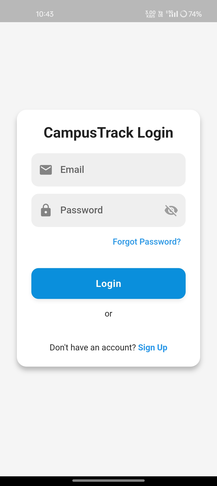 <br> 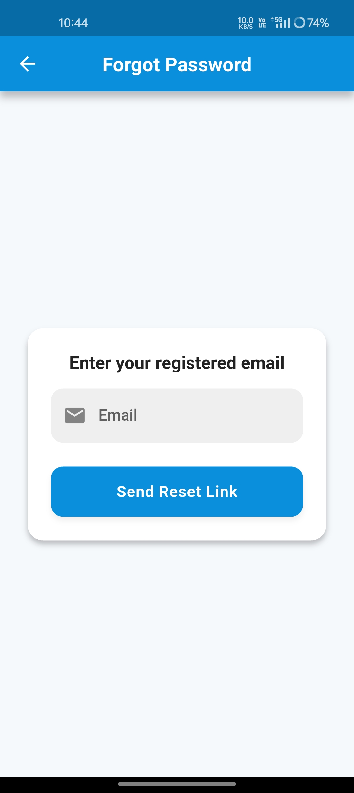 | 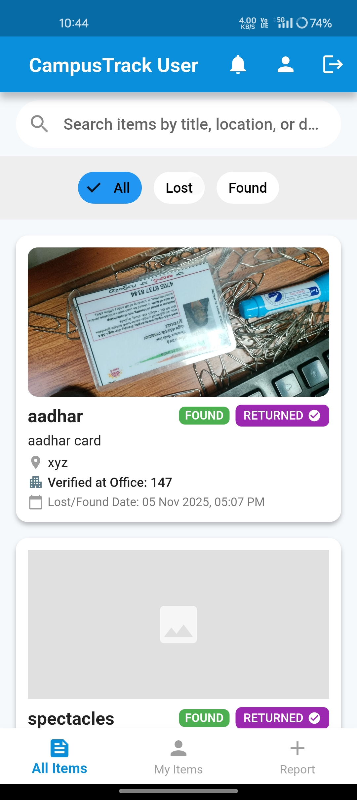 | 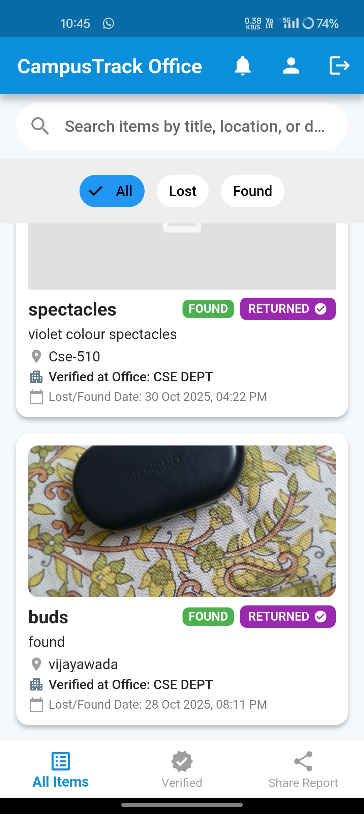 |

### 🔍 Item Reporting & Verification
| Item Detail Screen | Reporting Screen | Verification Screen |
| :---: | :---: | :---: |
| 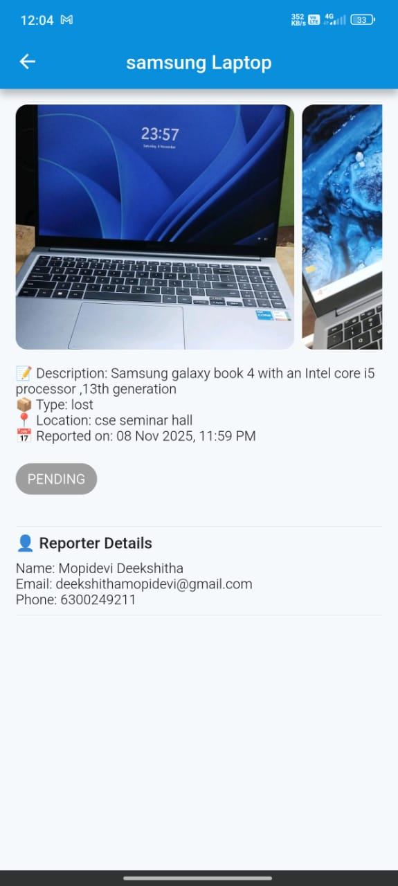 | 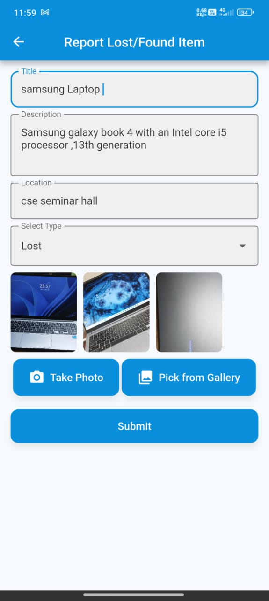 | 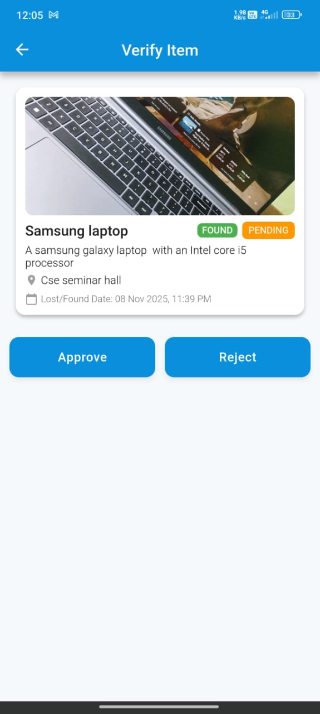 |

### 📅 Collection Scheduling & Claims
| Scheduling Pickup | Verifying Claim & ID | Admin Notification Logs |
| :---: | :---: | :---: |
| 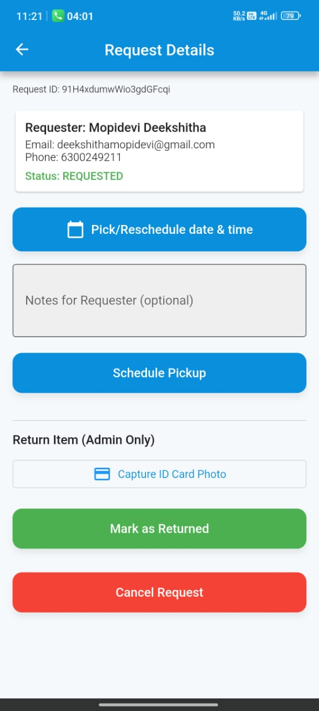 | 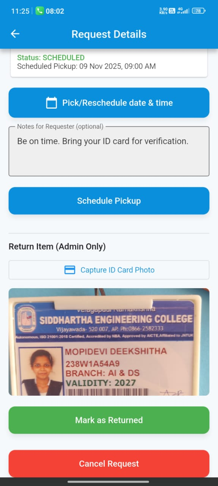 | 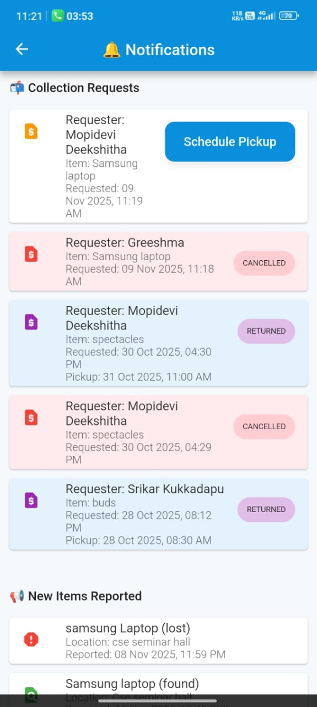 |

### 📊 Excel Report Output
| Exported Excel Sheets |
| :---: |
| 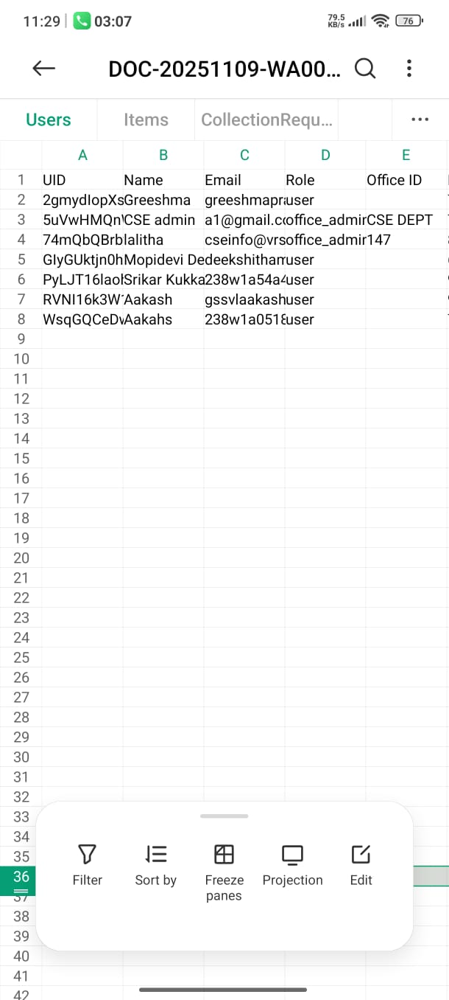 |

<<<<<<< HEAD
=======
---

## ⚙️ Installation & Setup

To run this project locally, follow these steps:

### 1. Prerequisites
*   Ensure you have the [Flutter SDK](https://docs.flutter.dev/get-started/install) installed (v3.1.0 or higher recommended).
*   Set up Android Studio, Xcode, or VS Code.
*   Create a Firebase project in the [Firebase Console](https://console.firebase.google.com/).

### 2. Clone the Repository
```bash
git clone https://github.com/greeshma1376/CampusTrack.git
cd CampusTrack/campustrack
```

### 3. Install Dependencies
```bash
flutter pub get
```

### 4. Configure Firebase
*   **Android:** Add your Android app package name to the Firebase project, download the `google-services.json` file, and place it in the `android/app/` directory.
*   **iOS:** Add your iOS bundle ID to the Firebase project, download the `GoogleService-Info.plist` file, and place it in the `ios/Runner/` directory.
*   Enable **Authentication** (Email/Password & Google Sign-In), **Cloud Firestore**, and **Cloud Storage** in the Firebase console.

### 5. Run the App
```bash
flutter run
```
>>>>>>> 581646b (uploaded all files)

---

## 🚀 Future Enhancements

*   **🤖 AI-Based Image Matching:** Integrate computer vision algorithms to automatically detect similarities between newly reported lost and found items.
*   **🎫 QR Code Labeling:** Generate and scan unique QR tags for verified items to expedite collection confirmation and inventory management.
*   **🌐 Web Dashboard Portal:** Extend administration capabilities via a dedicated web application interface for larger departmental screens.
*   **🏢 Multi-Campus Scalability:** Expand the architecture to support multiple distinct campuses under a single tenant databases setup.

---

<<<<<<< HEAD
=======
## 👥 Authors & Contributors

This project was submitted as part of the EPICS project report:
*   **K. S. S. N. S. Srikar**
*   **Greeshma Prasadam**
*   **Deekshitha Mopidevi**

*Developed under the guidance of Dr. Shaik Khaja Mohiddin (Associate Professor, CSE Dept at V.R. Siddhartha Engineering College).*
>>>>>>> 581646b (uploaded all files)
